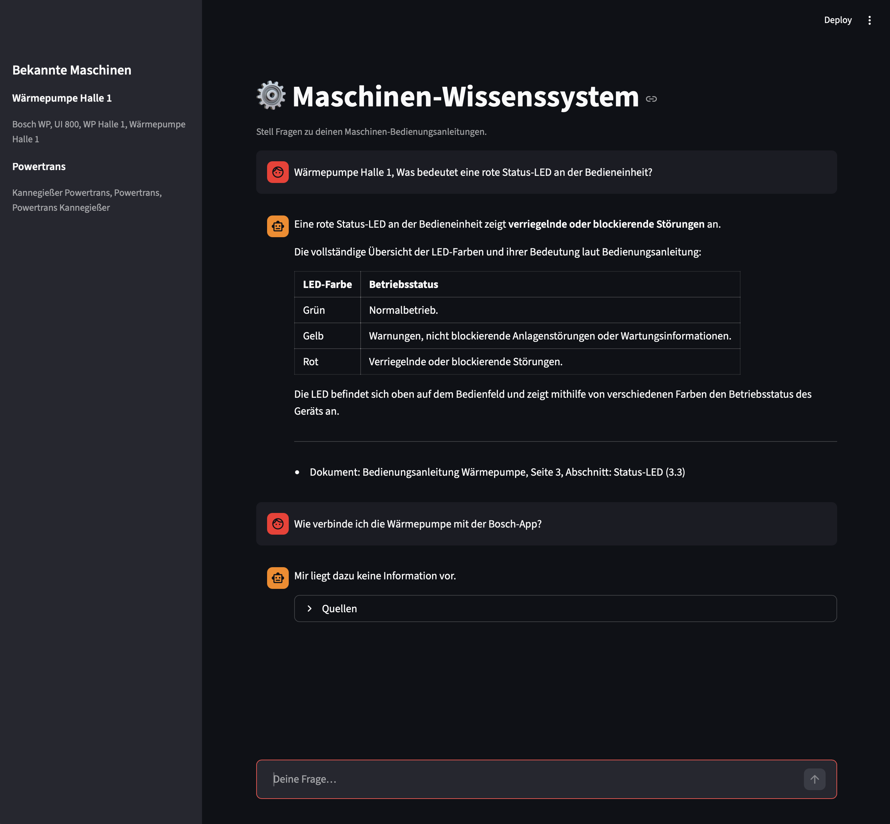
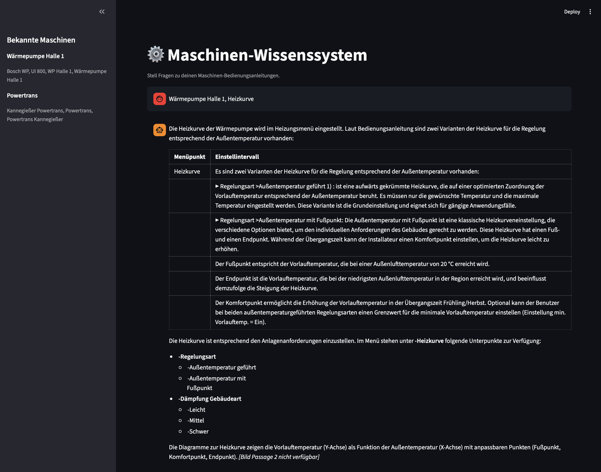
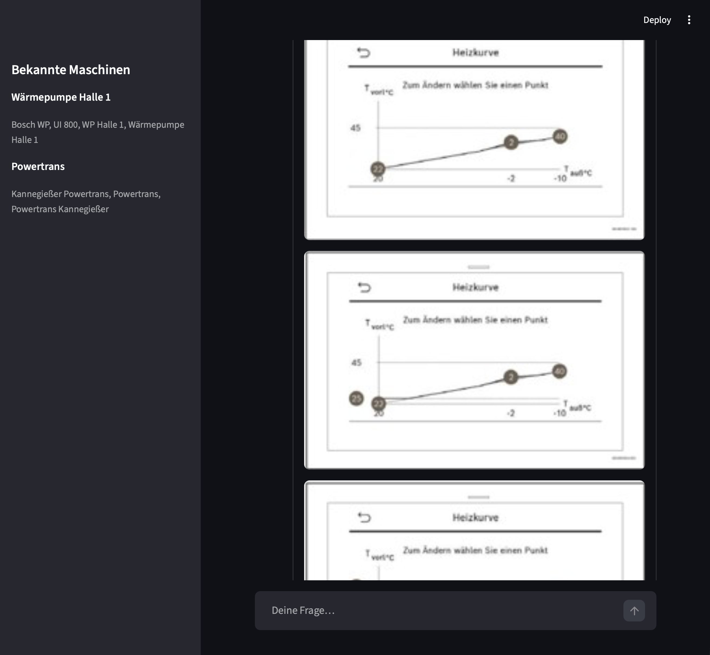

# Wissenssystem — Bedienungsanleitung RAG

Agentisches RAG-System für Maschinen-Bedienungsanleitungen.
Nutzer fragen in natürlicher Sprache; das System antwortet mit Text und Originalbildern
aus dem maschinenspezifischen Wissensspeicher.

**Stack:** Python ≥ 3.11 · Anthropic Claude (LLM + Vision; Ollama als lokaler Fallback) ·
sentence-transformers (`multilingual-e5-large`) · Qdrant · Docling · Streamlit · SQLite

---

## Beispiele

Das System ist bewusst auf **möglichst umfängliche und belastbare Antworten** ausgelegt,
damit Nutzer mit möglichst wenigen Rückfragen bestmöglich informiert sind.

### Vollständige Tabellenextraktion

Steht die angefragte Information in der Anleitung als Tabelle, gibt das System nicht nur
die angefragte Zeile zurück, sondern die gesamte Tabelle. So bekommt der Nutzer den vollen
Kontext (hier: alle LED-Farben und ihre Bedeutung) direkt mitgeliefert, statt für jede
Farbe erneut nachfragen zu müssen.



### Keine Antwort ohne Beleg im Handbuch

Ist eine Information nicht im Handbuch enthalten (im Beispiel oben: Verbindung mit der
Bosch-App), antwortet das System explizit mit "Mir liegt dazu keine Information vor"
statt eine plausibel klingende, aber erfundene Antwort zu generieren.

### Automatische Einbindung zugehöriger Grafiken

Zu manchen Themen — hier die Heizkurve — gehören Diagramme in der Originalanleitung.
Diese Bild-/Grafikpassagen werden separat gespeichert, dem passenden Textabschnitt
zugeordnet und bei einer entsprechenden Anfrage automatisch mit ausgegeben.




---

## Voraussetzungen

| Tool | Version | Wozu |
|------|---------|------|
| [uv](https://docs.astral.sh/uv/) | ≥ 0.4 | Dependency-Management |
| Anthropic API-Key | — | Default für LLM & Vision (`ANTHROPIC_API_KEY` in `.env`) |
| [Ollama](https://ollama.com/) (optional) | ≥ 0.3 | Lokaler Fallback ohne API-Key (`LLM_PROVIDER=ollama`, s. ADR-006) |
| Docker (optional) | — | Qdrant persistent; ohne Docker läuft Qdrant im Arbeitsspeicher |

Nur für den Ollama-Fallback — Modelle einmalig herunterladen:

```bash
ollama pull qwen2.5:3b
ollama pull moondream2
```

---

## Quickstart

```bash
# 1. Dependencies installieren
uv sync

# 2. Umgebungsvariablen anlegen — ANTHROPIC_API_KEY eintragen
#    (oder LLM_PROVIDER=ollama für den rein lokalen Fallback)
cp .env.example .env

# 3. Qdrant starten (optional — fällt sonst auf In-Memory-Modus zurück)
docker compose up -d qdrant

# 4. Maschinen-Registry befüllen
uv run python -m wissenssystem.cli.seed_registry \
    --db data/registry.db \
    --yaml data/machines.yaml

# 5. PDF ingestieren (Handbuch-PDFs sind nicht im Repo enthalten —
#    eigenes PDF unter data/sources/ ablegen)
uv run python -m wissenssystem.cli.ingest data/sources/ui800.pdf \
    --namespace cfg__bosch__ui800__nf87-02__de \
    --db data/registry.db

# 6. UI starten
uv run streamlit run src/wissenssystem/ui/streamlit_app.py
```

Die App öffnet sich unter `http://localhost:8501`.

---

## Ein Dokument ingestieren

```bash
uv run python -m wissenssystem.cli.ingest <pfad/zur/datei.pdf> \
    --namespace <namespace>   # z.B. cfg__bosch__ui800__nf87-02__de
    [--db data/registry.db]   # Standard: data/registry.db
```

Der Namespace folgt dem Schema `cfg__<hersteller>__<modell>__<sw-version>__<land>`.
Nach dem Ingest gibt das Skript einen `IngestReport` mit Chunk-, Bild-,
Menüpfad- und Safety-Counts aus.

---

## Eval ausführen

```bash
uv run python eval/run_eval.py \
    [--questions eval/questions.yaml] \
    [--db data/registry.db] \
    [--output eval/report.md]
```

Das Skript iteriert über alle 20 Fragen in `eval/questions.yaml`, ruft den
Orchestrator auf und prüft Themen, Sicherheits-Keywords, Menüpfade und
Beantwortbarkeit. Ergebnis: `eval/report.md` mit Pass/Fail-Tabelle und
Antworttexten.

Ziel-Score gemäß PoC-Erfolgskriterium: ≥ 80 %.

Weitere Fragensets: `eval/questions_attachments.yaml` (Tabellen-/Bild-Anhänge),
`eval/questions_kannegiesser.yaml` (zweite Maschine). Aktueller Stand:
[`eval/report.md`](eval/report.md) (20/20) und
[`eval/report_attachments.md`](eval/report_attachments.md) (5/5) —
überholte Zwischenstände liegen in `eval/archive/`.

---

## Tests

```bash
# Unit-Tests (kein laufender Dienst nötig)
uv run pytest tests/unit -x

# Integration-Tests (benötigt laufendes Qdrant und Ollama)
uv run pytest tests/integration -m integration

# Linting + Formatierung
uv run ruff format .
uv run ruff check --fix .
```

---

## Debugging

```bash
# Eine Query durch alle Pipeline-Stufen verfolgen
# (Intent → Machine-Resolution → Retrieval → Rerank → Antwort)
uv run python debug_query.py "Was bedeutet eine rote Status-LED?"

# Indexierte Chunks eines Namespace inspizieren (Filter, Suche, Statistiken)
uv run python -m wissenssystem.cli.inspect --namespace cfg__bosch__ui800__nf87-02__de --stats
```

---

## Projektstruktur

```
src/wissenssystem/
├── agent/          # IntentClassifier, MachineResolver, AnswerGenerator, Orchestrator
├── cli/            # ingest, inspect, seed_registry
├── domain/         # Pydantic-Modelle (immutable)
├── ingestion/      # Pipeline, Chunker, SafetyDetector, MenuPathExtractor, ImageDescriber, HyDE
├── interfaces/     # Protocol-Definitionen (kein konkreter Code)
├── providers/      # Anthropic (Claude LLM/Vision), Ollama, Docling, Claude-Vision-Parser,
│                   # SentenceTransformer, Qdrant, LocalBlobStore + Factories
├── registry/       # MachineRegistry (SQLite, kein ORM)
├── retrieval/      # HybridSearch (Dense + BM25 + RRF), MenuPathSearch, Reranker
└── ui/             # Streamlit-App

prompts/            # Alle LLM-Prompts als Markdown-Dateien
eval/               # Fragensets + run_eval.py; aktuelle Reports, archive/ für Altstände
data/               # machines.yaml, registry.db, blobs/, sources/
docs/               # learnings.md, technical_specification.md, demo-script.md, adr/
debug_query.py      # Trace-Tool: eine Query durch alle Pipeline-Stufen
```

Fachliche Setzungen und Nicht-Ziele: [`PROJECT.md`](PROJECT.md)
Technische Architektur und Datenmodell: [`ARCHITECTURE.md`](ARCHITECTURE.md)
Aufgaben und Abnahmekriterien: [`TASKS.md`](TASKS.md)
Erkenntnisse & Stolpersteine aus dem Aufbau: [`docs/learnings.md`](docs/learnings.md)
Technische Spezifikation: [`docs/technical_specification.md`](docs/technical_specification.md)
Demo-Drehbuch: [`docs/demo-script.md`](docs/demo-script.md)
Architektur-Entscheidungen: [`docs/adr/`](docs/adr/)

---

## Neue Maschine hinzufügen

1. Eintrag in `data/machines.yaml` anlegen (Name, Aliases, `configuration_namespace`).
2. `seed_registry` erneut ausführen.
3. PDF ingestieren mit dem neuen Namespace.
4. Fragen in `eval/questions.yaml` ergänzen.
